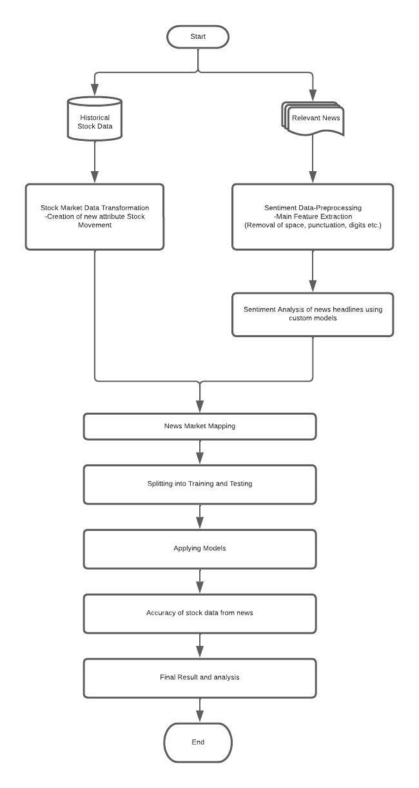

# Stock-Market-Movement-Predictor
- Group 1
[Website Link](https://bit.ly/3QWmpwH
)

## Flow Chart
***

***
## Project Description & Problem Statement
To understand how news headline emotion affects stock movement we merged the news sentiment feature along with the historical data as an independent variable. Deploy a web application capable of predicting the new day stock movement

- In finance field, stock market and its trends are extremely volatile in nature.

- News headline can have a drastic effect on stock prices (both in a positive and negative way).

- Create a model which analyzes the news headline using sentiment analysis using NLP and predict whether the stock prices will increase or decrease.

#### Technologies Used
- Keras
- Tensorflow
- NLTK
- SKIKIT-LEARN
- Flask
- AWS

#### Models Used
- Logistic Regression
- SVM
- LSTM
- Decision Tree
- Random forest
- ANN

***
## Conclusion

We implemented four classification models and two deep learning models and tested under different test scenarios. Then after comparing their results, ANN worked very well for all test cases ranging from 82% to 85% accuracy.
Accuracy followed by Random Forest is around 58%
SVM accuracy percentage is around 54%. 
Given any news Headline, it would be possible for the model to arrive on a polarity which would further predict the stock movement

